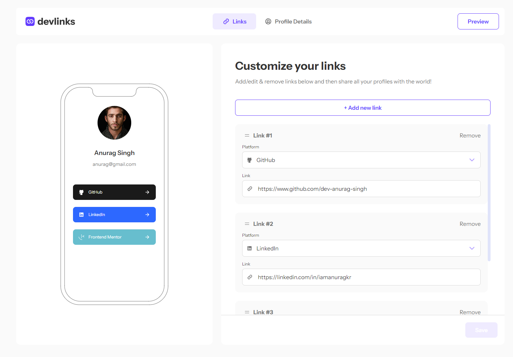
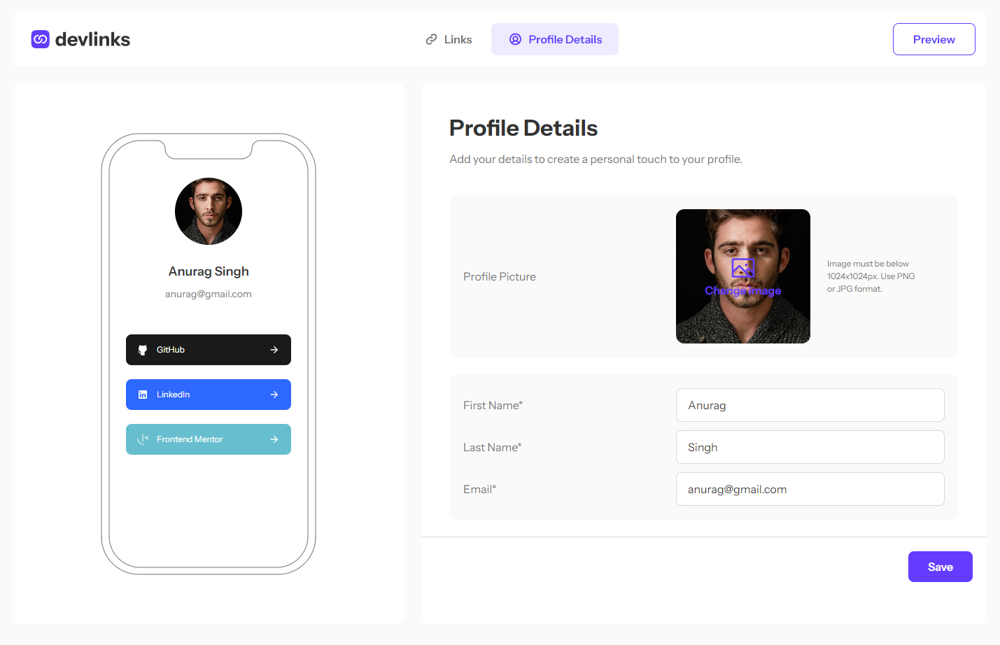

# 🌐 Devlinks - Your Digital Profile Hub

Devlinks is a web application that allows users to create a personalized digital profile with links to their social media and other platforms. With Devlinks, users can quickly share their contact details and online presence with others using a single link.

## 🚀 Features

- **User Authentication:** Securely sign up and log in using email and password.
- **Profile Creation:** Add your name, email, and profile picture to create a personalized profile.
- **Platform Links:** Easily add and manage links to your social media accounts, websites, or any other platforms.
- **Drag & Drop:** Easily reorder your links for a personalized experience.
- **Shareable Profile:** Generate a unique URL that you can share with anyone, providing quick access to all your profiles.
- **Responsive Design:** Optimized for both desktop and mobile devices.

## 🎨 Screenshots


_Dashboard Overview_


_Customize Profile_


_Preview_

## 🛠️ Tech Stack

- **Frontend:** [React.js](https://reactjs.org/) with [Tailwind CSS](https://tailwindcss.com/)
- **Database:** [Supabase](https://supabase.io/) for authentication and storage
- **Deployment:** [Vercel](https://vercel.com/)

## 🧑‍💻 Getting Started

### Prerequisites

- Node.js and npm installed on your machine.
- A Supabase account for database and authentication.

### Installation

1. Clone the repository:

   ```bash
   git clone https://github.com/dev-anurag-singh/devlinks.git
   cd ProfileLink
   ```

2. Install dependencies:

   ```bash
   npm install
   ```

3. Set up Supabase:

   Update services/supabase.js with your url and supabase public key

4. Run the development server:

   ```bash
   npm run dev
   ```

## 🙌 Contributing

Contributions are welcome! Please open an issue or submit a pull request for any improvements or suggestions.
